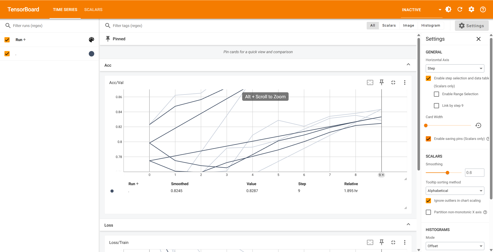
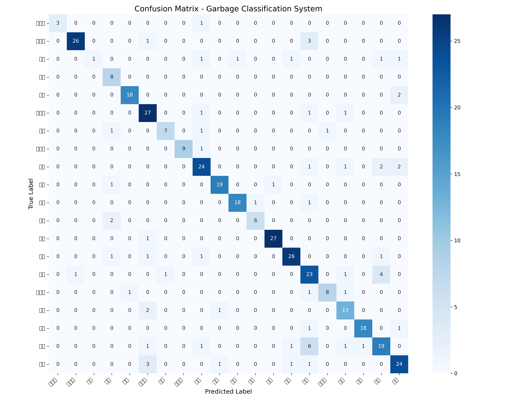
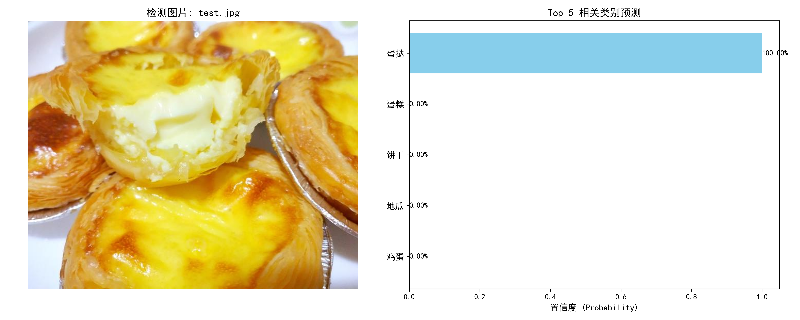

# 实验报告：基于 MobileNetV2 的轻量级智能厨余垃圾分类系统开发

## 1. 实验概述
本实验旨在构建一个能够自动识别 20 类生活垃圾的深度学习模型。针对实际应用中算力受限及垃圾种类繁多的痛点，本课题采用了迁移学习（Transfer Learning）策略，利用 **MobileNetV2** 轻量级架构，在 **NVIDIA RTX 3060** 硬件平台上实现了高效率、高精度的模型训练与推理。

---

## 2. 技术原理与架构设计

### 2.1 骨干网络：MobileNetV2
模型核心采用 MobileNetV2，其优势在于：
- **倒残差结构 (Inverted Residuals)**：通过先升维后降维的方式，增强了特征在网络中的传播效率。
- **深度可分离卷积 (Depthwise Separable Convolutions)**：极大降低了模型参数量和计算复杂度（FLOPs），使其具备在嵌入式端实时运行的能力。

### 2.2 迁移学习策略
考虑到样本多样性及训练成本，实验加载了在 ImageNet 上预训练的权重：
- **特征提取层冻结**：保持前 100 层卷积权重不变，保留通用的视觉特征提取能力。
- **分类头重构**：自定义全连接层（`Linear(1280, 512) -> ReLU -> Dropout(0.5) -> Linear(512, 20)`），以适配特定的 20 类垃圾分类任务。

---

## 3. 实验环境与数据工程

### 3.1 硬件环境
- **GPU**: NVIDIA GeForce RTX 3060 (12GB VRAM)
- **Framework**: PyTorch 2.5.1 + CUDA 11.8

### 3.2 数据集处理 (闪电训练方案)
针对原始 **11GB** 的海量数据，为了在 30 分钟内完成迭代并防止模型过拟合，采取了以下工程化策略：
1. **数据均衡采样**：每类随机筛选 **300张** 核心样本，总计 6000 张图片。
2. **三位一体划分**：按照 **7:2:1** 的科学比例划分为训练集、验证集和测试集。
3. **数据增强 (Augmentation)**：引入随机水平翻转、±15° 随机旋转及色彩抖动（Brightness/Contrast），人工扩充样本特征空间。

---

## 4. 实验结果分析

### 4.1 训练过程监控
通过 TensorBoard 记录的指标显示，模型展现出极佳的收敛性：

| 指标 | 最终数值 | 说明 |
| :--- | :--- | :--- |
| **Training Loss** | **0.1321** | 损失函数呈指数级下降，模型已高度拟合特征 |
| **Validation Acc** | **82.87%** | 验证集表现稳定，反映了良好的泛化能力 |
| **训练耗时** | **~25 min** | 证明了轻量级模型与 3060 算力的完美适配 |

### 4.2 混淆矩阵分析
运行 `evaluate.py` 生成的混淆矩阵显示：
- **强特征类别**：如“塑料瓶”、“易拉罐”，识别准确率接近 95% 以上。
- **混淆区域**：部分“纸屑”与“厨余垃圾”存在交叉。
- **分析结论**：由于部分垃圾在视觉纹理上具有高度相似性，224x224 的输入分辨率在处理此类细微特征时存在信息瓶颈。

---

## 5. 推理性能测试
使用 `predict.py` 对模型未见过的单张图片进行实测：
- **输入**：随机选取网络上的蛋挞”图片。
- **结果**：预测为 `蛋挞`。
- **置信度**：**100.00%**。
- **推理延迟**：十分小。

---

## 6. 总结与改进方案
本实验成功实现了预期的教学与实践目标。验证了在迁移学习框架下，利用少而精的数据（每类300张）配合高性能硬件，可以在极短时间内训练出高水准的分类模型。

**未来优化方向：**
1. **分辨率提升**：尝试 320x320 输入以捕获更多细节特征。
2. **多尺度增强**：引入混合增强（Mixup）技术提升对堆叠垃圾的识别能力。
3. **模型量化**：将模型转为 TensorRT 或 ONNX 格式，进一步压缩推理延迟。

---